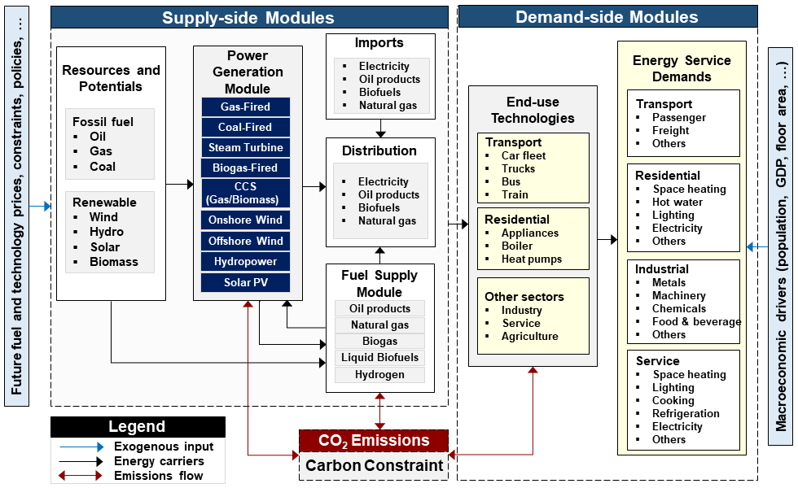

.. _ss:times_code:

TIMES Model Generator
=======================

Overview
--------

TIMES (The Integrated MARKAL-EFOM System) is a bottom-up optimization model generator for energy-environment systems analysis at various levels of spatial, temporal, and sectoral resolutions [#Loulou2016a; #Loulou2016]. The TIMES code, written in GAMS and available under an open-source license [#IEA-ETSAP2020a], is developed and maintained by the Energy Technology Systems Analysis Programme (ETSAP)\ [#]_ , a Technology Collaboration Programme (TCP) of the International Energy Agency (IEA), established in 1976. TIMES models can have single or several regions and typically are rich in technology detail, used for medium- to long-term energy system analysis and planning at a regional, national, or global scale.

Historical Development
~~~~~~~~~~~~~~~~~~~~~~

TIMES represents the evolution of two pioneering energy system modeling frameworks:

* **MARKAL (MARKet ALlocation):** Developed in the late 1970s, MARKAL was one of the first bottom-up energy system optimization models, focusing on technology-rich representations of energy systems.
* **EFOM (Energy Flow Optimization Model):** A complementary approach that emphasized energy flow balances and sectoral detail.

The integration of these two methodologies into TIMES combined their respective strengths, creating a more flexible and comprehensive modeling framework that has become the global standard for national and regional energy system planning.

Core Principles
~~~~~~~~~~~~~~~

TIMES is a linear optimization, techno-economic, partial-equilibrium model generator that assumes perfectly competitive markets and perfect foresight. Model variants enable myopic foresight, general equilibrium, stochastic programming, and a variety of multi-objective function options. The standard objective function maximizes the net total surplus (the sum of producers' and consumers' surpluses), which, in a perfect market with perfect foresight, equates to maximizing the net present value (NPV) of the whole energy system, maximizing societal welfare. Profits, taxes, and subsidies are internal transfers, i.e., occurring within the economy, that do not change the NPV (albeit taxes and subsidies can be included to influence the optimization). It calculates the energy system specification that minimizes discounted total energy system costs over the model time horizon, which is the sum of investments, fixed and variable costs, fuel import costs, and export revenues for all the modeled processes, less potential salvage values of investments for which the whole lifetime goes beyond the model time horizon.

Key Characteristics of TIMES Models
~~~~~~~~~~~~~~~~~~~~~~~~~~~~~~~~~~~

**Technology Explicit Representation:**

TIMES models contain detailed characterizations of hundreds to thousands of individual technologies, each defined by:

* Capital costs and operational expenditures
* Technical efficiency and performance parameters
* Capacity factors and availability constraints
* Lifetime and build time specifications
* Emission factors for multiple pollutants

**Temporal Flexibility:**

The framework supports flexible time resolution, allowing modelers to:

* Define milestone years for long-term planning (typically 5-year intervals over 30-50 year horizons)
* Specify intra-annual time slices to capture seasonal and diurnal variations in energy supply and demand
* Model storage technologies and variable renewable energy integration

**Multi-Regional Capabilities:**

TIMES supports multi-regional modeling with:

* Trade flows between regions for energy commodities
* Region-specific resource availability and costs
* Differentiated demand profiles and growth trajectories

**Environmental Accounting:**

Comprehensive tracking of environmental impacts including:

* Greenhouse gas emissions (CO2, CH4, N2O, F-gases)
* Air pollutants (SO2, NOx, particulate matter)
* Water usage and land use requirements

Model Inputs
------------

The user inputs the following to the model generator:

- **Reference Energy System (RES):** The process-flow architecture of economic sectors and energy flows (commodity) between processes (technology), which consume and produce energy, energy service demands and/or other commodities such as environmental emissions (including greenhouse gasses) and other materials. The base-year energy flows are calibrated to national energy balances.
- **Energy service demands:** The physical services required by the economy and society for mobility, heat, communications, food, etc., which drive energy demand.
- **Energy supply curves:** The quantities of primary energy resources (e.g., wind power) or imported commodities (e.g., oil, gas, bio-energy) available at specific cost points for differing quality and quantity of energy commodities.
- **Techno-economic parameters of existing and potential future energy technologies:** Economic parameters including current and projected future investment and fixed/variable costs and efficiencies of technologies for energy supply (e.g., solar PV panels, transmission and distribution infrastructure, biorefineries, hydrogen production) and energy demand (e.g., electric vehicles, natural gas boilers, carbon capture and storage); technological parameters including transformation efficiency, availability factor, capacity factor, and emissions factor.
- **User constraints:** Any combination of linear constraints (including fixed, maximum, or minimum bounds on growth, investment, or shares) on technologies or fuels. These are typically used to simulate real-world technology constraints or policy scenarios. A typical user constraint for decarbonization analysis is limiting total annual or cumulative CO2 emissions to model energy system pathways that meet a national decarbonization target.

Model Outputs
-------------

TIMES outputs the optimal investment and operation level of all energy technologies that meet future energy service demands at the least cost, while respecting user constraints. The model also produces corresponding energy flows, emissions, and marginal prices of energy and emissions flows.

Key outputs include:

* **Technology capacity and activity:** Optimal investment schedules and operational levels for all technologies
* **Energy commodity flows:** Detailed flows of fuels, electricity, heat, and other energy carriers
* **Emissions trajectories:** Time-series of GHG and pollutant emissions by sector and source
* **Marginal costs:** Shadow prices for energy commodities, emissions constraints, and capacity limits
* **System costs:** Total and annualized costs broken down by cost category and sector

.. [#] https://iea-etsap.org/

.. _ss:tim_overview:

TIMES-Ireland Model (TIM)
=========================

Introduction
------------

The TIMES-Ireland Model (TIM) is a single-region national energy system model for Ireland, developed to support evidence-based energy and climate policy analysis. TIM is built using the TIMES framework and provides a comprehensive representation of Ireland's energy system from primary resource extraction through to final energy service demands.

TIM serves as a critical tool for:

* Informing Ireland's Climate Action Plan and carbon budget allocations
* Evaluating technology pathways for achieving net-zero emissions by 2050
* Assessing the cost-effectiveness of different decarbonization strategies
* Analyzing the role of emerging technologies such as hydrogen, carbon capture, and advanced biofuels
* Supporting energy security and infrastructure planning decisions

.. _ss:system_overview:

Model Architecture
------------------

   Simplified representation of reference energy system in TIM

Figure 1 illustrates a simplified Reference Energy System (RES) within the TIMES-Ireland Model (TIM). It delineates the structure and energy flows, encompassing two primary components:

* **Supply-side:** Encompasses energy resources (domestic fossil fuels and renewables), fuel production and conversion technologies (biorefineries, hydrogen production, power plants), and transmission/distribution infrastructure (gas pipelines, power grid).
* **Demand-side:** Covers end-use sectors (transport, residential, etc.) and their corresponding energy service demands (passenger transport, freight, hot water, etc.).

Energy resources, both domestic and imported, are processed and distributed across the country. End-use technologies consume these energy commodities to satisfy the energy service demands of various sectors. Greenhouse gas (GHG) emissions, arising from fossil fuel combustion and industrial processes, are meticulously tracked at the fuel supply, electricity generation, and sectoral consumption levels.

Sectoral Coverage
~~~~~~~~~~~~~~~~~

TIM provides detailed representation of the following sectors:

**Supply Sectors:**

* Electricity generation (thermal, renewable, storage, interconnection)
* Oil refining and distribution
* Natural gas supply and distribution
* Hydrogen production and delivery
* Bioenergy production (biogas, biomethane, biofuels)
* District heating

**Demand Sectors:**

* Residential buildings (space heating, water heating, cooking, appliances, lighting)
* Commercial and public services (similar end-uses as residential)
* Industry (process heat, steam, mechanical drive, feedstocks)
* Transport (passenger cars, buses, rail, freight, aviation, shipping)
* Agriculture (machinery, heating, other energy uses)

Base Year Calibration
~~~~~~~~~~~~~~~~~~~~~

The model's base year is 2018, with all energy flows, emissions, and energy technology stocks calibrated to the 2018 Irish energy balance [SEAI2019]. This calibration ensures that:

* Total primary energy supply matches official statistics
* Sectoral final energy consumption is accurately represented
* Existing technology stock reflects installed capacities
* Emissions inventory aligns with national GHG reporting

Time Horizon and Resolution
~~~~~~~~~~~~~~~~~~~~~~~~~~~

TIM typically models the period from 2018 to 2050 or 2070, with:

* **Milestone years:** 5-year intervals (2020, 2025, 2030, etc.)
* **Intra-annual time slices:** Representing seasonal and diurnal variations in energy supply and demand patterns
* **Technology vintages:** Tracking investments by year of installation to model technology turnover

Economic Parameters
-------------------

**Discount Rate:**

The discount rate, signifying the degree to which future values are discounted to the present, is a pivotal parameter in the TIMES objective function. A *social discount rate* reflects societal preferences regarding present versus future costs and benefits, typically lower than a *financial discount rate* used by firms for investment decisions. The Irish government employs a social discount rate of 4% in this model, aligned with the Social Rate of Time Preference methodology outlined in the Public Spending Code [OCallaghan2018]. This rate is consistent with recommendations by Garcia-Gusano et al. (2016) for a maximum social discount rate of 4-5% in Energy System Optimization Models (ESOMs).

**Technology-Specific Discount Rates:**

Technology-specific discount rates, also known as hurdle rates, are often used in ESOMs to model investment decisions from the individual or industry perspective. They account for market imperfections, financial limitations, and behavioral factors that can hinder the adoption of novel or capital-intensive technologies. These parameters are not incorporated in the core TIM version, as it focuses on long-term energy system pathways from a societal viewpoint. However, model variants can be developed to simulate real-world policy and behavioral impacts, potentially including hurdle rates [Aryanpur2022].

**Currency and Cost Basis:**

All costs in TIM are expressed in constant 2018 Euros, providing a consistent basis for comparing technologies and scenarios across the modeling horizon.

Key Model Features
------------------

**Renewable Energy Integration:**

TIM includes detailed modeling of Ireland's substantial renewable energy potential, particularly:

* Onshore and offshore wind resources with location-specific capacity factors
* Solar PV potential accounting for Ireland's irradiance patterns
* Ocean energy (wave and tidal) technologies
* Biomass and biogas resources with sustainability constraints

**Electrification Pathways:**

The model captures cross-sectoral electrification opportunities:

* Electric vehicle adoption in transport
* Heat pump deployment in buildings
* Industrial electrification for low-temperature heat

**Hydrogen Economy:**

TIM represents emerging hydrogen technologies including:

* Green hydrogen production via electrolysis
* Blue hydrogen with carbon capture
* Hydrogen storage and distribution infrastructure
* End-use applications in transport, industry, and power generation

**Carbon Management:**

Comprehensive carbon accounting and mitigation options:

* Carbon capture and storage (CCS) for power generation and industry
* Bioenergy with CCS (BECCS) for negative emissions
* Direct air capture technologies
* Land use and forestry interactions (where applicable)

Policy Applications
-------------------

TIM has been applied to support numerous policy analyses including:

* Ireland's Climate Action Plan development
* Carbon budget allocation across sectors
* Renewable electricity target setting
* Building retrofit strategy assessment
* Transport decarbonization pathway analysis
* Industrial emissions reduction planning
* Energy security and import dependency analysis
